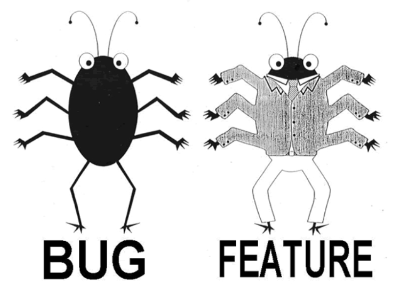

= Test Document: This is a demo of AsciiDoc
:doctype: book
:toc:
:author: obliguedon
:email: <your.email@example.com>
:revdate: 2024-01-23
:revnumber: v0.1
:revremark: WIP
:orgname: <My org>

:!sectnums:
[abstract]
== Abstract
--
this document is a test/demonstration of what can be done with AsciiDoc.
The learning curve is as flat as possible, get in the train, it's easier than you think.
--

[preface]
== Preface
You will see a series of examples for images, tables, diagrams or other features of the Asciidoc syntaxin this document.

ifdef::env-pdf[]
== List Of Figures
list-of::image[]

== List Of Tables
list-of::table[]

== List Of Code
list-of::listing[]
endif::env-pdf[]

:sectnums:

<<<

== The Emu War

[quote, 'original article https://en.wikipedia.org/wiki/Emu_War[wikipedia]']
--
The Emu War, also known as the Great Emu War, was a nuisance wildlife management military operation
undertaken in Australia over the later part of 1932 to address public concern over the number of emus
said to be destroying crops in the Campion district within the Wheatbelt of Western Australia.
The unsuccessful attempts to curb the population of emus, a large flightless bird indigenous to Australia,
employed Royal Australian Artillery soldiers armed with Lewis guns—leading the media to adopt the name "Emu War"
when referring to the incident.
While a number of the birds were killed, the emu population persisted and continued to cause crop destruction.
--

<<<
== Let's make lists

below different kind of list :

=== unordered list

* disney
** snow white
** frozen
* pixar
** toy story

=== ordered list

. git pull
.. git submodule update
. make
.. make test
.. make install

=== TODO list
- [ ] washing dishes
- [x] do the laundry
- [ ] start fitness

=== description list

Kids nowadays just don't apreciate the sacrifices you make for their birthdays::
my daughter just screamed as I cut the goat's throat.
I've never been good at taking responsibility for my actions::
can't believe my parents raised me this way.
the worst addiction ever is being addicted to buying defective brakes::
you won't be able to stop.

=== Mixing things

Operating Systems::
  Linux:::
    . Fedora
      * Desktop
    . Ubuntu
      * [ ] Desktop
      * [x] Server
  BSD:::
    . FreeBSD
    . NetBSD

<<<
== let's play with images

=== image from a file

.it's not a bug, it's a feature

=== diagram from text description

==== Ditaa

[ditaa]
....
                   +-------------+
                   | Asciidoctor |-------+
                   |   diagram   |       |
                   +-------------+       | PNG out
                       ^                 |
                       | ditaa in        |
                       |                 v
 +--------+   +--------+----+    /---------------\
 |        | --+ Asciidoctor +--> |               |
 |  Text  |   +-------------+    |   Beautiful   |
 |Document|   |   !magic!   |    |    Output     |
 |     {d}|   |             |    |               |
 +---+----+   +-------------+    \---------------/
     :                                   ^
     |          Lots of work             |
     +-----------------------------------+
....

==== Wavedrom

[wavedrom, format=svg]
....
{ signal: [
  { name: 'clk0', wave: 'phnlPHNL' },
  { name: 'clk1', wave: 'xhlhLHl.' },
  { name: 'clk2', wave: 'hpHplnLn' },
  { name: 'clk3', wave: 'nhNhplPl' },
  { name: 'clk4', wave: 'xlh.L.Hx' },
  {},
  { name: "clk",         wave: "p.....|..." },
  { name: "Data",        wave: "x.345x|=.x", data: ["head", "body", "tail", "data"] },
  { name: "Request",     wave: "0.1..0|1.0" },
  {},
  { name: "Acknowledge", wave: "1.....|01." }
]}
....

==== PlantUML

[plantuml]
....
[*] --> IDLE : rst_n

IDLE --> INIT : start_init

INIT -right-> RUNNING : end_init

RUNNING -up-> IDLE : stop

IDLE : nothing to do

INIT : launch some things
INIT : wait for a signal

RUNNING : not to fast
RUNNING : need to keep my breath
....
<<<
== Now's the time for tables

=== basic table

.Inner circle - bad boys
[cols="1,1,1,1"]
|===
| Bad | Boys | Bad | Boys

| Whatcha | Gonna | Do | ?

|Whatcha
|gonna
|do
|when

|then
|come
|for
|you

|===

=== table in table

.Coolio - Gangsta's paradise
[cols="1,1,1a,1"]
|===
| Tell | Me | Why | Are

| We
| So
| Blind
| To

| See
|
|

[cols="1,1,1"]
!===
! That ! The ! One

! We
! Hurt
! Are

! You
! And
! Me?

!===

|

|===

=== table from csv file

.my table
[format=csv]
|===
include::myTable.csv[]
|===

=== who did that thing ?

.unknow creature
[cols="e,m,^,>s",width="25%"]
|===
|1 >s|2 |3 |4
^|5 2.2+^.^|6 .3+<.>m|7
^|8
|9 2+>|10
|===

<<<
== Others feature

=== Admonition block

CAUTION: see this text below ?

IMPORTANT: it's an important text (no kiding)

[NOTE]
====
here is a block that tell the absolute truth::
you're wrong, it's possible.
====

=== the block

====
hello everyone
====

=== math

latexmath:[a^2 + b^2 = c^2]

=== unicode characters

Noto Sans SignWriting::
  * 𝪡 ¶𝡐𝠳𝠨𝢽𝤊𝤶𝥆𝦐𝦑𝦞𝧡
Noto Sans Symbols 2::
  * 🯱🯲🯳🯴🯵🯶 🂮🂱🂲🂳 🡢🡭🡱🡼 ␀␆␍␊␛ ⌦⌨⌖⏱⏸⏹⏻⏯
  * ⇦⇮🠊🠳🡄🡹🡾🢗🢠 ▧◐◔🞕🞠 🬙🬧🬺🭈🭊🭕🭩🭼🮔🮭🮵
  * 🯅🯆🯉 ☞⛕🗎🗺
  * ⠑⠁⠎⠊⠊ ⠊⠉
  * 🀀🀃🀝🀛🀧🀢
  * 🀾🁮🁶🁕🁤
  * 🨀🨁🨅🨄
Noto Music::
  * 𝄆 𝄙𝆏 𝅗𝅘𝅥𝅘𝅥𝅯𝅘𝅥𝅱 𝄞𝄟𝄢 𝄾𝄿𝄎 𝄴 𝄶𝅁 𝄭𝄰 𝇛
  * 𝇜 𝄊 𝄇 𝀸𝀹𝀺𝀻𝀼𝀽 𝈀𝈁𝈂𝈃𝈄𝈅
Noto Sans Math::
  * 𝞉𝞩ϑϕϰϱϵℊℎ⏞∬∮≦⨁
Noto Emoji::
  * 🥰💀✌️🌴🐢🐐🍄⚽🍻👑📸😬👀🚨🏡🕊️🏆😻🌟🧿🍀🎨🍜

== code highlighting

=== verilog

.counter.v
[source, verilog, linenums]
----
include::counter.v[lines=14..53]
----
